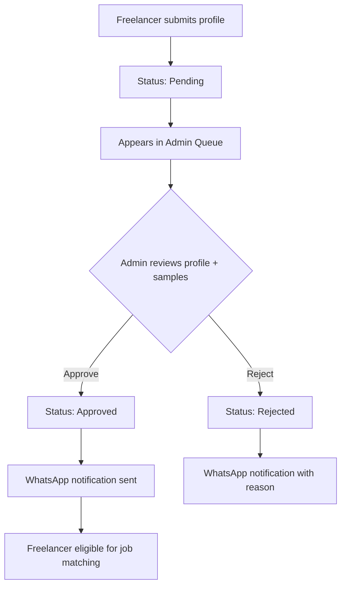
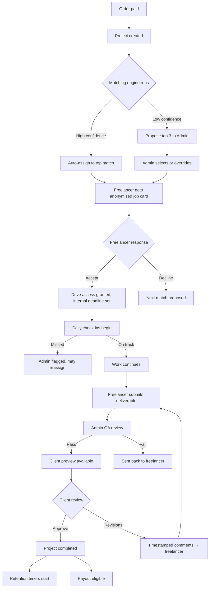
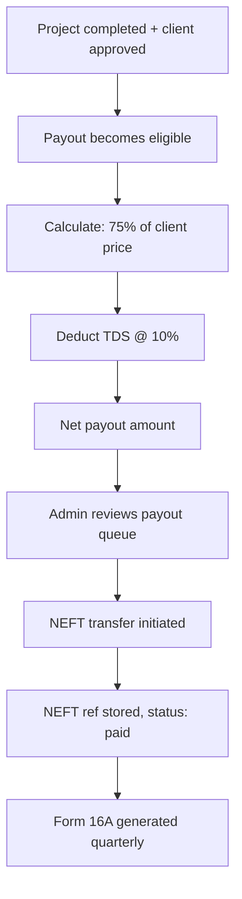
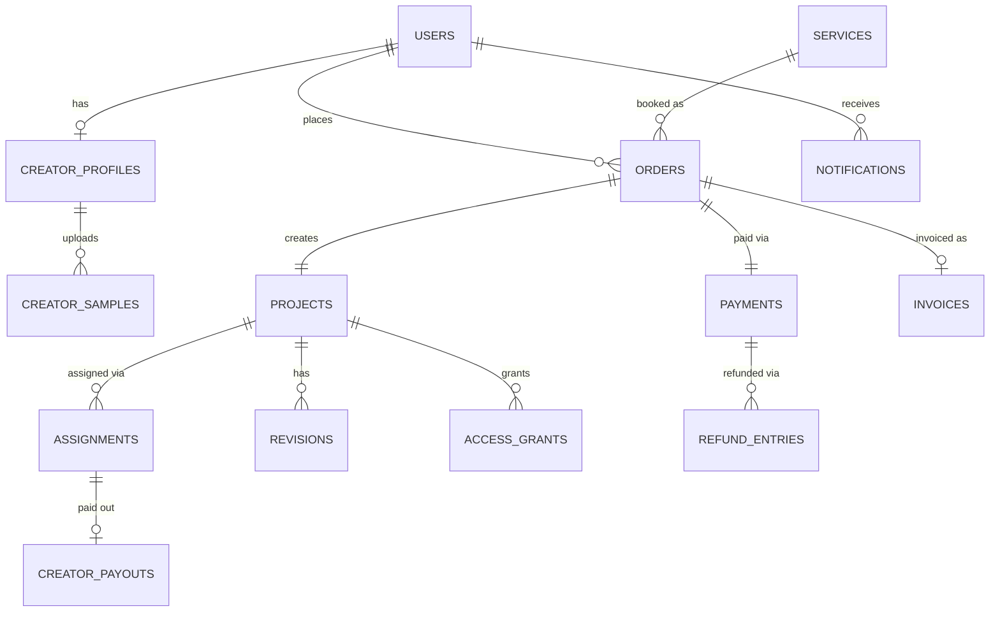

# Artsy Production — Comprehensive Implementation Plan

## 1. Problem & Vision

Artsy Production is a **two-sided post-production marketplace** — a platform connecting clients (wedding, brand, corporate) with curated video/photo editors. The goal is to build the complete product from scratch: a marketing site that generates leads today, and a full transactional platform (booking → payment → assignment → delivery → payout) that scales.

This plan consolidates and supersedes the existing `artsy-production-master-plan.md`. It covers **every screen, every flow, every integration, and every gap** — organized by build phase so engineering proceeds in the order that actually unblocks real usage.

---

## User Review Required

> [!IMPORTANT]
> **Business Entity & Registrations**: The plan assumes GST, TAN, and Razorpay merchant registration are started in parallel. Checkout, invoicing, and payouts **cannot go live** until this chain completes — even if code is ready.

> [!IMPORTANT]
> **Freelancer Payout Base**: The 75/25 split is defined, but the calculation base (gross client price vs. after GST/gateway fees) needs confirmation before the payout module is built.

> [!WARNING]
> **WhatsApp OTP Setup**: Requires a Meta Business Account, verified business phone number, and approved authentication template. This has a lead time — should be initiated immediately.

> [!CAUTION]
> **DPDP Act Compliance**: India's data protection rules overlap with the launch window (enforcement through Nov 2026 – May 2027). Consent management and data-deletion flows are included in this plan from Phase 1.

---

## Open Questions

1. **Payout calculation base** — Is the 75% freelancer share calculated from the gross client price, or from the amount after GST and gateway fees?
2. **Exact GST rate** — Needs accountant confirmation for SAC classification of post-production services.
3. **Change-order workflow** — The existing plan references mid-project scope changes but has no screens, flows, or data model. Should this be deferred to a later phase or designed now?
4. **International payouts** — Are international freelancers in scope for any near-term phase?
5. **Enterprise/multi-user accounts** — Defer entirely, or build basic org support in Phase 3?
6. **Domain & hosting** — Confirm the production domain name and Vercel project setup.

---

## 2. Tech Stack (Confirmed)

| Layer | Technology | Notes |
|---|---|---|
| **Frontend** | Next.js 14+ (App Router) | React Server Components, TypeScript |
| **Styling** | Vanilla CSS + CSS Custom Properties | Design token system, no Tailwind |
| **Backend / DB** | Supabase (Postgres + Edge Functions) | Row Level Security, Realtime subscriptions |
| **Auth / OTP** | Meta WhatsApp Cloud API (direct) | Cheapest India rates; fallback SMS TBD |
| **Payments** | Razorpay | Cards / UPI / Net Banking |
| **Video Streaming** | Bunny Stream | ~$1/1000 min stored, adaptive bitrate, basic DRM |
| **File Storage** | Google Drive API (raw footage) + Supabase Storage (assets) | Time-limited, scoped access grants |
| **Hosting** | Vercel | Edge functions, preview deployments |
| **AI Layer** | OpenAI / Gemini API (Phase 3+) | Pricing suggestions, creator matching, QA assist |

---

## 3. Design System

### 3.1 Design Tokens

```css
:root {
  /* Surfaces */
  --bg-primary:      #F4F5F7;
  --bg-card:         #FFFFFF;
  --bg-tag:          #E4EEFB;

  /* Text */
  --text-headline:   #16233F;   /* Navy */
  --text-body:       #374151;
  --text-muted:      #6B7280;
  --text-tag:        #1B4C87;

  /* Accent */
  --accent-blue:     #3D7DC2;   /* Links, buttons, tags */
  --accent-hover:    #2D6AAF;

  /* Borders */
  --border-default:  #DCDFE3;
  --border-focus:    #3D7DC2;

  /* Status */
  --status-success:  #059669;
  --status-warning:  #D97706;
  --status-error:    #DC2626;
  --status-pending:  #6B7280;

  /* Shadows */
  --shadow-sm:       0 1px 2px rgba(0,0,0,0.05);
  --shadow-md:       0 4px 12px rgba(0,0,0,0.08);
  --shadow-lg:       0 8px 24px rgba(0,0,0,0.12);

  /* Radii */
  --radius-sm:       6px;
  --radius-md:       10px;
  --radius-lg:       16px;
  --radius-full:     9999px;

  /* Spacing scale (4px base) */
  --space-1: 4px;  --space-2: 8px;  --space-3: 12px;
  --space-4: 16px; --space-5: 20px; --space-6: 24px;
  --space-8: 32px; --space-10: 40px; --space-12: 48px;
  --space-16: 64px;
}
```

### 3.2 Typography

| Role | Font | Weight | Size |
|---|---|---|---|
| Headlines | **Inter** or **Outfit** (geometric sans) | 700 | 32–56px |
| Body | **Inter** | 400/500 | 14–16px |
| Labels/Tags | **JetBrains Mono** (mono accent) | 500 | 11–13px |
| Section Index | **JetBrains Mono** | 700 | 14px |

### 3.3 Signature Visual Elements

- **Scrolling marquee band** of service categories (CSS `@keyframes` animation, no JS library)
- **Bracketed numeric index** per section: `[ 01 ]`, `[ 02 ]` — inspired by nudot.com.tw
- **Glassmorphic stat cards** on dashboards (backdrop-filter blur + semi-transparent bg)
- **Micro-animations**: hover lifts on cards, progress bar fills, status badge pulses
- **Responsive**: mobile-first breakpoints at 640px, 768px, 1024px, 1280px

---

## 4. Build Phases

### Phase 1 — Marketing Site (Ships Independently)

> **Goal**: A production-quality, single-page marketing site that generates leads and establishes brand.

#### Pages & Sections

**Single scrolling page structure:**

| Section | Content | Key Elements |
|---|---|---|
| **Navigation** | Logo, section links, "Get Started" CTA | Sticky nav, blur backdrop on scroll |
| **Hero** | Headline, subline, CTA buttons | Animated marquee band below hero |
| **Services** | 4 service category cards | Wedding Films · Brand/UGC Reels · Store/Product Reels · Corporate/Event Videos |
| **Work / Portfolio** | Showcase grid of past work | Filterable by category, hover-to-play video thumbnails |
| **About** | Studio story, team, values | Stats counter animation on scroll |
| **Contact** | Contact form + WhatsApp link | Name, email, phone, service interest, message |
| **Footer** | Links, social, legal | Privacy policy link, copyright |

#### Files to Create

```
/app
  layout.tsx          — Root layout (fonts, meta, global CSS)
  page.tsx            — Marketing homepage
  globals.css         — Design tokens + global styles

/components
  /marketing
    Navbar.tsx         — Sticky navigation
    Hero.tsx           — Hero section with CTA
    Marquee.tsx        — Scrolling service marquee band
    Services.tsx       — Service category cards
    ServiceCard.tsx    — Individual service card
    Portfolio.tsx      — Work showcase grid
    PortfolioItem.tsx  — Individual portfolio piece
    About.tsx          — About section with animated stats
    Contact.tsx        — Contact form
    Footer.tsx         — Site footer

/styles
  tokens.css          — CSS custom properties (design tokens)
  animations.css      — Keyframe animations (marquee, fade-in, counters)
  components.css      — Component-level styles

/public
  /images             — Generated brand images, portfolio samples
  /fonts              — Self-hosted font files (if not using Google Fonts CDN)
```

#### SEO & Meta

- Unique `<title>`: "Artsy Production — Professional Video & Photo Post-Production"
- Meta description, Open Graph tags, Twitter Card
- Single `<h1>` per page, semantic HTML5 structure
- `robots.txt`, `sitemap.xml`

---

### Phase 2 — Authentication & User System

> **Goal**: WhatsApp OTP login for all user roles, role-based routing, and session management.

#### Screens

| Screen | Description |
|---|---|
| **Login** | Phone number input → "Send OTP via WhatsApp" button |
| **OTP Verification** | 6-digit input (auto-advancing), "Verify" button, "Resend" with 60s cooldown timer |
| **Role Router** | Post-auth redirect: new freelancer → onboarding; approved freelancer → dashboard; client → catalog/dashboard; admin → admin panel |

#### Technical Implementation

```
/app
  /auth
    /login/page.tsx           — Phone input screen
    /verify/page.tsx          — OTP entry screen

/lib
  supabase/
    client.ts                 — Supabase client singleton
    server.ts                 — Server-side Supabase client
    middleware.ts             — Auth middleware for protected routes

  whatsapp/
    send-otp.ts               — Meta WhatsApp Cloud API OTP dispatch
    verify-otp.ts             — OTP verification logic
    templates.ts              — WhatsApp message template IDs

/supabase
  /migrations
    001_users.sql             — users table + RLS policies
    002_sessions.sql          — Session management
```

#### Data Model — Users

```sql
CREATE TABLE users (
  id            UUID PRIMARY KEY DEFAULT gen_random_uuid(),
  phone         TEXT UNIQUE NOT NULL,
  phone_verified BOOLEAN DEFAULT FALSE,
  role          TEXT CHECK (role IN ('client', 'freelancer', 'admin')) DEFAULT 'client',
  status        TEXT CHECK (status IN ('active', 'suspended', 'deleted')) DEFAULT 'active',
  consent_given_at  TIMESTAMPTZ,       -- DPDP Act consent timestamp
  consent_version   TEXT,               -- Version of privacy policy consented to
  created_at    TIMESTAMPTZ DEFAULT NOW(),
  last_login    TIMESTAMPTZ,
  deleted_at    TIMESTAMPTZ            -- Soft delete for data retention compliance
);

-- RLS: users can read their own row; admins can read all
```

#### DPDP Compliance (Built In From Day 1)

- Consent checkbox at registration with link to privacy policy
- Consent timestamp and policy version stored in user record
- Data export endpoint (user can request their data)
- Data deletion endpoint (soft delete → hard delete after retention period)
- Privacy policy page (`/privacy`)

---

### Phase 3 — Freelancer Onboarding & Admin Approval

> **Goal**: Freelancers submit profiles, admin reviews and approves/rejects.

#### Screens

| Screen | Description |
|---|---|
| **Freelancer Onboarding Form** | Multi-section form: personal info, skills, samples, financial details |
| **Submission Confirmation** | "Your profile is under review" status page |
| **Admin Approval Queue** | List of pending freelancer submissions with quick-glance info |
| **Admin Freelancer Detail** | Full profile view with sample reel previews, Approve/Reject actions |

#### Freelancer Onboarding Form — Field Spec

| Section | Fields |
|---|---|
| **Personal** | Display name, Bio (textarea, 500 char max) |
| **Skills** | Skills (multi-select chips: Color Grading, Motion Graphics, Sound Design, etc.), Software (multi-select: Premiere Pro, DaVinci Resolve, After Effects, etc.), Years of experience (dropdown), Languages (multi-select) |
| **Availability** | Weekly availability (hours/week slider), Preferred shift (morning/afternoon/evening/flexible) |
| **Portfolio** | Portfolio URL (validated), 2–4 sample reel links (each tagged by service type) |
| **Financial** | PAN number (encrypted at rest), Bank account name, Bank account number (encrypted), IFSC code |

#### Files to Create

```
/app
  /freelancer
    /onboarding/page.tsx       — Multi-step onboarding form
    /dashboard/page.tsx        — Freelancer dashboard (stub, built in Phase 5)
    /profile/page.tsx          — View/edit own profile

  /admin
    /layout.tsx                — Admin layout with sidebar nav
    /freelancers/page.tsx      — Approval queue list
    /freelancers/[id]/page.tsx — Freelancer detail + approve/reject

/components
  /freelancer
    OnboardingForm.tsx         — Multi-step form component
    SkillSelector.tsx          — Multi-select chip input
    SampleReelInput.tsx        — Dynamic reel link inputs with tag selector
    ProfileCard.tsx            — Freelancer profile summary card

  /admin
    Sidebar.tsx                — Admin navigation sidebar
    ApprovalQueue.tsx          — Pending freelancer list
    FreelancerReview.tsx       — Full review view with actions
```

#### Data Model — Creator Profiles

```sql
CREATE TABLE creator_profiles (
  user_id           UUID PRIMARY KEY REFERENCES users(id),
  display_name      TEXT NOT NULL,
  bio               TEXT,
  skills            TEXT[] DEFAULT '{}',
  software          TEXT[] DEFAULT '{}',
  experience_years  INTEGER,
  languages         TEXT[] DEFAULT '{}',
  availability      JSONB,               -- { hours_per_week, preferred_shift }
  portfolio_url     TEXT,
  pan_number        TEXT,                 -- Encrypted via Supabase Vault
  bank_details      JSONB,               -- Encrypted: { name, account_number, ifsc }
  approval_status   TEXT CHECK (approval_status IN ('pending', 'approved', 'rejected')) DEFAULT 'pending',
  rejection_reason  TEXT,
  approved_at       TIMESTAMPTZ,
  approved_by       UUID REFERENCES users(id),
  created_at        TIMESTAMPTZ DEFAULT NOW(),
  updated_at        TIMESTAMPTZ DEFAULT NOW()
);

CREATE TABLE creator_samples (
  id          UUID PRIMARY KEY DEFAULT gen_random_uuid(),
  creator_id  UUID REFERENCES creator_profiles(user_id),
  url         TEXT NOT NULL,
  type        TEXT,                      -- 'wedding', 'brand', 'corporate', 'product'
  tags        TEXT[] DEFAULT '{}',
  approved    BOOLEAN DEFAULT FALSE,
  created_at  TIMESTAMPTZ DEFAULT NOW()
);
```

#### Admin Approval Flow



---

### Phase 4 — Service Catalog & Client Booking

> **Goal**: Clients browse services, configure requirements via a smart wizard, see pricing, and book.

#### Screens

| Screen | Description |
|---|---|
| **Service Catalog** | 4 category cards with descriptions and starting prices |
| **Service Detail** | Category deep-dive with sub-service options |
| **Requirement Wizard** | Dynamic, category-specific multi-step form |
| **Price Summary** | Calculated price breakdown, "Proceed to Checkout" CTA |
| **Checkout** | Order summary + Razorpay payment integration |
| **Booking Confirmation** | Order confirmed, upload instructions, project tracking link |

#### Requirement Wizard — Per Category

| Category | Wizard Questions |
|---|---|
| **Wedding Films** | Output type (Highlight / Full Film / Both), Duration range, Song choice / reference link, Number of camera angles/footage sources, Rush delivery? |
| **Brand & UGC Reels** | Platform(s) (Instagram / YouTube / TikTok / Other), Number of variants needed, Footage volume estimate, Turnaround (standard / rush), Aspect ratios needed |
| **Store & Product Reels** | Number of products, Videos per product, Platform(s), Footage volume per product, Turnaround |
| **Corporate & Event** | Event type, Duration of raw footage, Number of camera angles, Number of deliverables, Turnaround |

#### Pricing Engine

```
Base Price (admin-set per service)
  + Duration adjustment (multiplier)
  + Complexity adjustment (camera angles / footage volume)
  + Variant multiplier (number of deliverables)
  + Rush fee (if applicable)
  = Subtotal
  + GST (absorbed, shown separately on invoice only)
  = Total displayed to client
```

- AI suggests price → if within admin-set floor/ceiling AND confidence > threshold → auto-quote
- Otherwise → routes to admin for approval before showing to client

#### Files to Create

```
/app
  /services/page.tsx                    — Service catalog grid
  /services/[category]/page.tsx         — Category detail
  /book/page.tsx                        — Requirement wizard
  /book/checkout/page.tsx               — Checkout + Razorpay
  /book/confirmation/page.tsx           — Booking confirmation

  /api
    /pricing/route.ts                   — Pricing calculation endpoint
    /orders/route.ts                    — Order creation
    /payments/webhook/route.ts          — Razorpay webhook handler

/components
  /booking
    ServiceCatalog.tsx
    ServiceCard.tsx
    RequirementWizard.tsx
    WizardStep.tsx
    PriceSummary.tsx
    CheckoutForm.tsx

/lib
  pricing/
    engine.ts                           — Pricing calculation logic
    rules.ts                            — Admin-configurable pricing rules
  razorpay/
    client.ts                           — Razorpay SDK setup
    webhook.ts                          — Webhook signature verification
```

#### Data Model — Services, Orders, Payments

```sql
CREATE TABLE services (
  id            UUID PRIMARY KEY DEFAULT gen_random_uuid(),
  category      TEXT NOT NULL,           -- 'wedding', 'brand_ugc', 'store_product', 'corporate_event'
  name          TEXT NOT NULL,
  description   TEXT,
  base_price    INTEGER NOT NULL,        -- In paise (₹)
  pricing_rules JSONB,                   -- Admin-editable adjustment rules
  active        BOOLEAN DEFAULT TRUE,
  created_at    TIMESTAMPTZ DEFAULT NOW(),
  updated_at    TIMESTAMPTZ DEFAULT NOW()
);

CREATE TABLE orders (
  id                  UUID PRIMARY KEY DEFAULT gen_random_uuid(),
  client_id           UUID REFERENCES users(id),
  service_id          UUID REFERENCES services(id),
  requirements_json   JSONB NOT NULL,     -- Wizard answers
  calculated_price    INTEGER,            -- AI/engine calculated
  admin_approved_price INTEGER,           -- If admin override needed
  final_price         INTEGER NOT NULL,   -- In paise
  gst_amount          INTEGER,            -- Calculated GST (shown on invoice)
  status              TEXT CHECK (status IN (
                        'draft', 'pending_price_approval', 'quoted',
                        'payment_pending', 'paid', 'in_progress',
                        'delivered', 'revision_requested', 'completed',
                        'cancelled', 'refunded'
                      )) DEFAULT 'draft',
  marketing_consent   BOOLEAN DEFAULT FALSE,
  created_at          TIMESTAMPTZ DEFAULT NOW(),
  updated_at          TIMESTAMPTZ DEFAULT NOW()
);

CREATE TABLE payments (
  id            UUID PRIMARY KEY DEFAULT gen_random_uuid(),
  order_id      UUID REFERENCES orders(id),
  gateway       TEXT DEFAULT 'razorpay',
  gross_amount  INTEGER NOT NULL,
  gst_amount    INTEGER DEFAULT 0,
  gateway_fee   INTEGER DEFAULT 0,
  net_amount    INTEGER NOT NULL,
  gateway_ref   TEXT,                     -- Razorpay payment ID
  status        TEXT CHECK (status IN ('created', 'authorized', 'captured', 'failed', 'refunded')) DEFAULT 'created',
  refund_amount INTEGER DEFAULT 0,
  refund_reason TEXT,
  created_at    TIMESTAMPTZ DEFAULT NOW()
);
```

---

### Phase 5 — Project Management, Assignment & Delivery

> **Goal**: Full project lifecycle — admin assigns editors, editors work, QA review, client preview, revisions, final delivery.

#### Screens

| Screen | Role | Description |
|---|---|---|
| **Admin Dashboard** | Admin | Overview: active projects, pending assignments, revenue, alerts |
| **Admin Project List** | Admin | All projects with filters (status, assigned, overdue) |
| **Admin Project Detail** | Admin | Full project view: assignment, progress, QA, client comms |
| **Admin Services & Pricing** | Admin | CRUD for services and pricing rules |
| **Freelancer Dashboard** | Freelancer | Available jobs, assigned work, active projects, earnings |
| **Freelancer Job Card** | Freelancer | Anonymised job brief, accept/decline |
| **Freelancer Work View** | Freelancer | Drive access, daily check-in, submit deliverable |
| **Client Dashboard** | Client | Active orders, project status tracking |
| **Client Project View** | Client | Status timeline, preview player, revision comments |
| **Preview Player** | Client | Bunny Stream embedded player with timestamped commenting |

#### Assignment & Matching Flow



#### Daily Check-in System

- Freelancer gets a WhatsApp prompt each day at their preferred time
- Must respond: "Started" / "In Progress (X%)" / "Blocked (reason)"
- Missed check-in after 2 hours → Admin flagged via notification
- Admin can verify offline (call), then reassign if needed

#### Client Preview & Revision System

- Delivered video uploaded to Bunny Stream → embedded player in client dashboard
- Client can leave **timestamped comments** (click on timeline → type comment)
- Comments grouped by revision round (Round 1, Round 2, etc.)
- Freelancer sees revision comments in their work view

#### Files to Create

```
/app
  /admin
    /dashboard/page.tsx
    /projects/page.tsx
    /projects/[id]/page.tsx
    /services/page.tsx                  — Services & Pricing CRUD
    /payouts/page.tsx

  /freelancer
    /dashboard/page.tsx
    /jobs/page.tsx
    /jobs/[id]/page.tsx
    /work/[projectId]/page.tsx

  /client
    /dashboard/page.tsx
    /projects/page.tsx
    /projects/[id]/page.tsx             — Status + preview player + revision comments

  /api
    /projects/route.ts
    /assignments/route.ts
    /assignments/checkin/route.ts
    /revisions/route.ts
    /drive/access/route.ts

/components
  /project
    ProjectTimeline.tsx
    StatusBadge.tsx
    AssignmentCard.tsx
    CheckinPrompt.tsx

  /preview
    VideoPlayer.tsx                     — Bunny Stream embed
    TimestampComment.tsx
    RevisionThread.tsx

  /dashboard
    StatCard.tsx                        — Glassmorphic animated stat cards
    RevenueChart.tsx
    ProjectsTable.tsx

/lib
  bunny/
    client.ts                           — Bunny Stream API
    upload.ts                           — Video upload handler
  drive/
    client.ts                           — Google Drive API
    access.ts                           — Scoped, time-limited sharing
  matching/
    engine.ts                           — Creator matching algorithm
    scoring.ts                          — Skill/availability/performance scoring
```

#### Data Model — Projects, Assignments, Revisions

```sql
CREATE TABLE projects (
  id                    UUID PRIMARY KEY DEFAULT gen_random_uuid(),
  order_id              UUID REFERENCES orders(id),
  assigned_creator_id   UUID REFERENCES users(id),
  drive_folder_id       TEXT,
  bunny_video_id        TEXT,
  status                TEXT CHECK (status IN (
                          'pending_assignment', 'assigned', 'in_progress',
                          'submitted', 'qa_review', 'revision_needed',
                          'client_review', 'approved', 'completed'
                        )) DEFAULT 'pending_assignment',
  internal_deadline     TIMESTAMPTZ,       -- 4-6 days (before client SLA)
  client_deadline       TIMESTAMPTZ,       -- 7-10 days
  raw_footage_expires   TIMESTAMPTZ,       -- +15 days from completion
  final_file_expires    TIMESTAMPTZ,       -- +30 days from completion
  created_at            TIMESTAMPTZ DEFAULT NOW(),
  updated_at            TIMESTAMPTZ DEFAULT NOW()
);

CREATE TABLE assignments (
  id                  UUID PRIMARY KEY DEFAULT gen_random_uuid(),
  project_id          UUID REFERENCES projects(id),
  creator_id          UUID REFERENCES users(id),
  match_score         DECIMAL,
  match_method        TEXT,               -- 'auto' or 'admin_selected'
  proposed_at         TIMESTAMPTZ DEFAULT NOW(),
  accepted_at         TIMESTAMPTZ,
  declined_at         TIMESTAMPTZ,
  internal_deadline   TIMESTAMPTZ,
  last_checkin_at     TIMESTAMPTZ,
  checkin_status      TEXT CHECK (checkin_status IN ('on_track', 'missed', 'escalated', 'blocked')),
  reassigned_from     UUID REFERENCES assignments(id),
  reassignment_reason TEXT,
  status              TEXT CHECK (status IN ('proposed', 'accepted', 'declined', 'completed', 'reassigned')) DEFAULT 'proposed'
);

CREATE TABLE revisions (
  id                UUID PRIMARY KEY DEFAULT gen_random_uuid(),
  project_id        UUID REFERENCES projects(id),
  round_no          INTEGER NOT NULL,
  timestamp_seconds DECIMAL,              -- Position in video timeline
  comment           TEXT NOT NULL,
  author_id         UUID REFERENCES users(id),
  author_role       TEXT,                 -- 'client', 'admin', 'freelancer'
  status            TEXT CHECK (status IN ('open', 'addressed', 'resolved')) DEFAULT 'open',
  created_at        TIMESTAMPTZ DEFAULT NOW()
);

CREATE TABLE access_grants (
  id            UUID PRIMARY KEY DEFAULT gen_random_uuid(),
  project_id    UUID REFERENCES projects(id),
  creator_id    UUID REFERENCES users(id),
  drive_folder  TEXT NOT NULL,
  permission_id TEXT,                     -- Google Drive permission ID
  granted_at    TIMESTAMPTZ DEFAULT NOW(),
  expires_at    TIMESTAMPTZ NOT NULL,
  revoked_at    TIMESTAMPTZ
);
```

---

### Phase 6 — Payouts, Invoicing & Financial Compliance

> **Goal**: Automated freelancer payouts, GST invoicing, TDS compliance, refund handling.

#### Screens

| Screen | Role | Description |
|---|---|---|
| **Admin Payout Queue** | Admin | Pending payouts, approve/process batch |
| **Freelancer Earnings** | Freelancer | Earnings history, payout status, TDS certificates |
| **Client Invoices** | Client | Downloadable GST invoices for all orders |

#### Payout Flow



#### Data Model — Payouts

```sql
CREATE TABLE creator_payouts (
  id              UUID PRIMARY KEY DEFAULT gen_random_uuid(),
  assignment_id   UUID REFERENCES assignments(id),
  creator_id      UUID REFERENCES users(id),
  gross_payout    INTEGER NOT NULL,       -- 75% of client price (in paise)
  tds_rate        DECIMAL DEFAULT 0.10,
  tds_amount      INTEGER NOT NULL,
  net_payout      INTEGER NOT NULL,
  pan_number      TEXT NOT NULL,
  neft_ref        TEXT,
  form16a_url     TEXT,
  status          TEXT CHECK (status IN ('pending', 'approved', 'processing', 'paid', 'failed')) DEFAULT 'pending',
  approved_by     UUID REFERENCES users(id),
  paid_at         TIMESTAMPTZ,
  created_at      TIMESTAMPTZ DEFAULT NOW()
);

CREATE TABLE invoices (
  id            UUID PRIMARY KEY DEFAULT gen_random_uuid(),
  order_id      UUID REFERENCES orders(id),
  invoice_number TEXT UNIQUE NOT NULL,    -- Sequential: ARTSY-2026-0001
  client_id     UUID REFERENCES users(id),
  subtotal      INTEGER NOT NULL,
  gst_rate      DECIMAL,                 -- Configurable, nullable until GST reg complete
  gst_amount    INTEGER DEFAULT 0,
  total         INTEGER NOT NULL,
  gstin         TEXT,                     -- Configurable field, populated post-registration
  pdf_url       TEXT,
  created_at    TIMESTAMPTZ DEFAULT NOW()
);

-- Refund ledger (compensating entries, not edits)
CREATE TABLE refund_entries (
  id            UUID PRIMARY KEY DEFAULT gen_random_uuid(),
  payment_id    UUID REFERENCES payments(id),
  order_id      UUID REFERENCES orders(id),
  amount        INTEGER NOT NULL,
  reason        TEXT NOT NULL,
  type          TEXT CHECK (type IN ('full', 'partial', 'progress_scaled')),
  approved_by   UUID REFERENCES users(id),
  gateway_ref   TEXT,
  status        TEXT CHECK (status IN ('pending', 'approved', 'processed', 'failed')) DEFAULT 'pending',
  created_at    TIMESTAMPTZ DEFAULT NOW()
);
```

#### GST Configuration

```sql
-- Admin-editable config, not hardcoded
CREATE TABLE platform_config (
  key     TEXT PRIMARY KEY,
  value   JSONB NOT NULL,
  updated_at TIMESTAMPTZ DEFAULT NOW()
);

-- Example entries:
-- { key: 'gst_enabled', value: false }
-- { key: 'gst_rate', value: 0.18 }
-- { key: 'gstin', value: null }
-- { key: 'tds_rate', value: 0.10 }
-- { key: 'tan_number', value: null }
```

---

### Phase 7 — Notifications & Communication

> **Goal**: WhatsApp notifications for all critical events, in-app notification center.

#### Notification Events

| Event | Recipient | Channel |
|---|---|---|
| OTP sent | User | WhatsApp |
| Profile submitted | Admin | In-app + WhatsApp |
| Profile approved/rejected | Freelancer | WhatsApp |
| New job available | Freelancer | WhatsApp |
| Job accepted | Admin | In-app |
| Check-in missed | Admin | WhatsApp + In-app |
| Deliverable submitted | Admin | In-app |
| QA passed → preview ready | Client | WhatsApp |
| Revision requested | Freelancer | WhatsApp + In-app |
| Project completed | Client + Freelancer | WhatsApp |
| Payout processed | Freelancer | WhatsApp |
| Retention expiry warning (3 days before) | Client | WhatsApp |

#### Data Model

```sql
CREATE TABLE notifications (
  id          UUID PRIMARY KEY DEFAULT gen_random_uuid(),
  user_id     UUID REFERENCES users(id),
  type        TEXT NOT NULL,
  title       TEXT NOT NULL,
  body        TEXT,
  channel     TEXT[] DEFAULT '{in_app}',  -- 'in_app', 'whatsapp'
  read        BOOLEAN DEFAULT FALSE,
  metadata    JSONB,                      -- Links, action buttons
  created_at  TIMESTAMPTZ DEFAULT NOW()
);
```

---

### Phase 8 — AI Production OS (V3 Features)

> **Goal**: AI-assisted pricing, creator matching, QA, and learning loop.

| Feature | Description |
|---|---|
| **AI Pricing Suggestion** | Analyses requirement wizard inputs → suggests price. Uses historical order data for calibration. |
| **AI Creator Matching** | Scores freelancers on: skill match, availability, past performance, turnaround reliability. Confidence threshold determines auto-assign vs. admin review. |
| **AI QA Assist** | Basic automated checks on delivered video (duration match, resolution, audio levels). Flags obvious issues before admin manual review. |
| **AI Revision Classification** | Categorises client revision comments (color correction, audio, pacing, content) to help freelancer prioritize. |
| **Learning Loop** | Tracks admin overrides of AI decisions (pricing, matching) → feeds back to improve future suggestions. |

---

## 5. Complete Data Model — ER Diagram



---

## 6. Folder Structure — Complete

```
artsy-web/
├── app/
│   ├── layout.tsx
│   ├── page.tsx                        (Marketing homepage)
│   ├── globals.css
│   ├── privacy/page.tsx
│   ├── auth/
│   │   ├── login/page.tsx
│   │   └── verify/page.tsx
│   ├── services/
│   │   ├── page.tsx
│   │   └── [category]/page.tsx
│   ├── book/
│   │   ├── page.tsx
│   │   ├── checkout/page.tsx
│   │   └── confirmation/page.tsx
│   ├── client/
│   │   ├── dashboard/page.tsx
│   │   ├── projects/page.tsx
│   │   └── projects/[id]/page.tsx
│   ├── freelancer/
│   │   ├── onboarding/page.tsx
│   │   ├── dashboard/page.tsx
│   │   ├── profile/page.tsx
│   │   ├── jobs/page.tsx
│   │   ├── jobs/[id]/page.tsx
│   │   └── work/[projectId]/page.tsx
│   ├── admin/
│   │   ├── layout.tsx
│   │   ├── dashboard/page.tsx
│   │   ├── freelancers/page.tsx
│   │   ├── freelancers/[id]/page.tsx
│   │   ├── projects/page.tsx
│   │   ├── projects/[id]/page.tsx
│   │   ├── services/page.tsx
│   │   └── payouts/page.tsx
│   └── api/
│       ├── auth/otp/route.ts
│       ├── pricing/route.ts
│       ├── orders/route.ts
│       ├── payments/webhook/route.ts
│       ├── projects/route.ts
│       ├── assignments/route.ts
│       ├── assignments/checkin/route.ts
│       ├── revisions/route.ts
│       ├── drive/access/route.ts
│       └── notifications/route.ts
├── components/
│   ├── ui/                             (Shared UI primitives)
│   ├── marketing/
│   ├── booking/
│   ├── freelancer/
│   ├── admin/
│   ├── project/
│   ├── preview/
│   └── dashboard/
├── lib/
│   ├── supabase/
│   ├── whatsapp/
│   ├── razorpay/
│   ├── bunny/
│   ├── drive/
│   ├── pricing/
│   └── matching/
├── styles/
│   ├── tokens.css
│   ├── animations.css
│   └── components.css
├── supabase/
│   └── migrations/
├── public/
│   ├── images/
│   └── fonts/
├── package.json
├── next.config.js
├── tsconfig.json
└── .env.local
```

---

## 7. Verification Plan

### Automated Tests

```bash
# Unit tests for pricing engine
npm run test -- --testPathPattern=pricing

# Unit tests for matching engine
npm run test -- --testPathPattern=matching

# API route tests
npm run test -- --testPathPattern=api

# Full build verification
npm run build
```

### Manual Verification

| Phase | Verification |
|---|---|
| Phase 1 | Marketing site loads, responsive on mobile/tablet/desktop, all sections render, contact form submits, Lighthouse score > 90 |
| Phase 2 | OTP flow end-to-end (send → verify → redirect by role), session persists on refresh |
| Phase 3 | Freelancer onboarding form submits, appears in admin queue, approve/reject triggers WhatsApp notification |
| Phase 4 | Browse services → wizard → price calculation → Razorpay checkout → payment webhook → order created |
| Phase 5 | Project lifecycle: assignment → check-ins → submission → QA → client preview → revision → completion |
| Phase 6 | Invoice generation with correct GST, payout calculation with TDS, refund as compensating entry |
| Phase 7 | All notification events trigger correct WhatsApp/in-app messages |

---

## 8. External Dependencies & Parallel Tracks

| Dependency | Owner | Status | Blocks |
|---|---|---|---|
| Business entity registration | Karan | Not started | GST, TAN, Razorpay |
| GST registration | Karan + Accountant | In progress | Invoice GST itemization |
| TAN registration | Karan + Accountant | Not started | TDS deduction on payouts |
| Razorpay merchant account | Karan | Not started | Payment processing |
| Meta Business Account + WhatsApp template | Karan | Not started | OTP delivery |
| Bunny Stream account | Karan | Not started | Video preview player |
| Google Cloud project (Drive API) | Engineering | Not started | Raw footage access |
| Domain + Vercel project | Engineering | Not started | Deployment |
| Freelancer agreement (legal) | Karan + Lawyer | Deferred | Freelancer onboarding T&C |
| Customer ToS + Privacy Policy | Karan + Lawyer | Deferred | Consent flows |

---

## 9. Timeline Estimate

| Phase | Scope | Estimated Duration |
|---|---|---|
| **Phase 1** | Marketing Site | 1–2 weeks |
| **Phase 2** | Auth & User System | 1 week |
| **Phase 3** | Freelancer Onboarding + Admin Approval | 1–2 weeks |
| **Phase 4** | Service Catalog + Booking + Payments | 2–3 weeks |
| **Phase 5** | Project Management + Assignment + Delivery | 3–4 weeks |
| **Phase 6** | Payouts + Invoicing + Compliance | 1–2 weeks |
| **Phase 7** | Notifications | 1 week |
| **Phase 8** | AI Features | 2–4 weeks (iterative) |

**Total estimated: ~12–19 weeks** for a production-ready V1+V2 platform.

> [!TIP]
> Phase 1 (Marketing Site) can ship independently and start generating leads while the rest of the platform is built. **Start here.**
